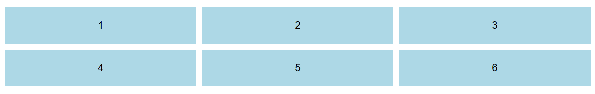
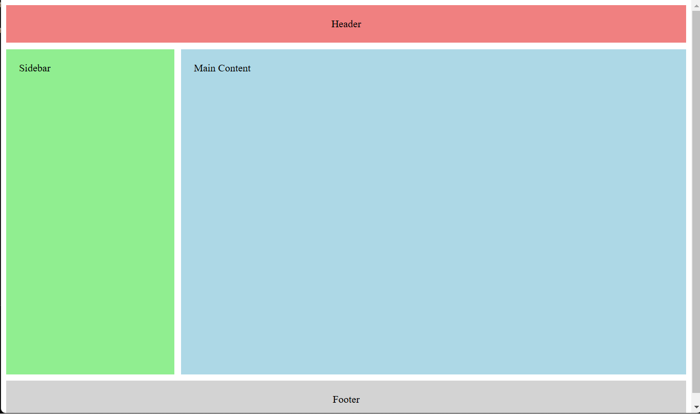
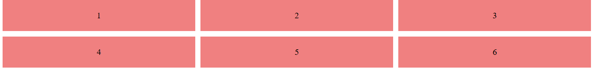
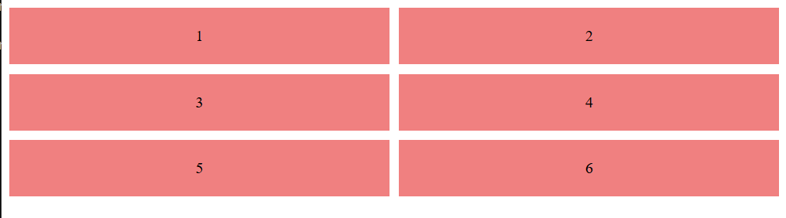
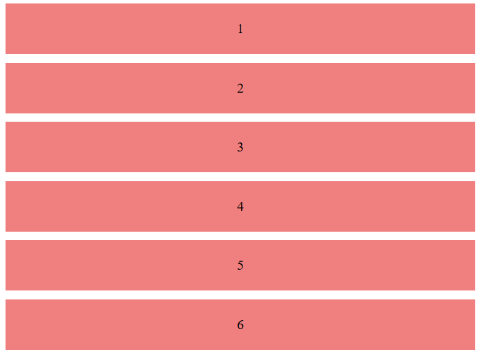

# oefeningen op grid

## Maak een basis lay-out met 3 kolommen en 2 rijen.

## Gebruik grid-template-areas om een lay-out te maken met een header, zijbalk, hoofdinhoud en een footer.

## Maak een responsieve lay-out die verandert op basis van de schermgrootte.

groter dan 900px

groter dan 600px

onder de 600px

